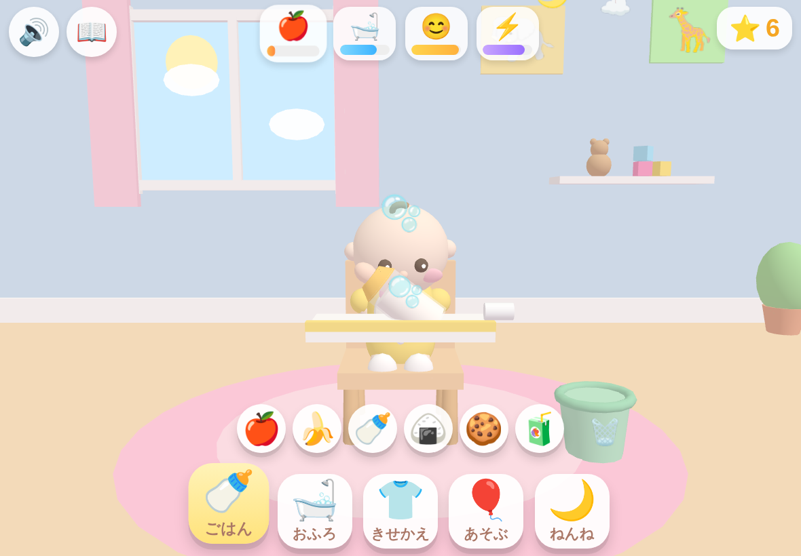
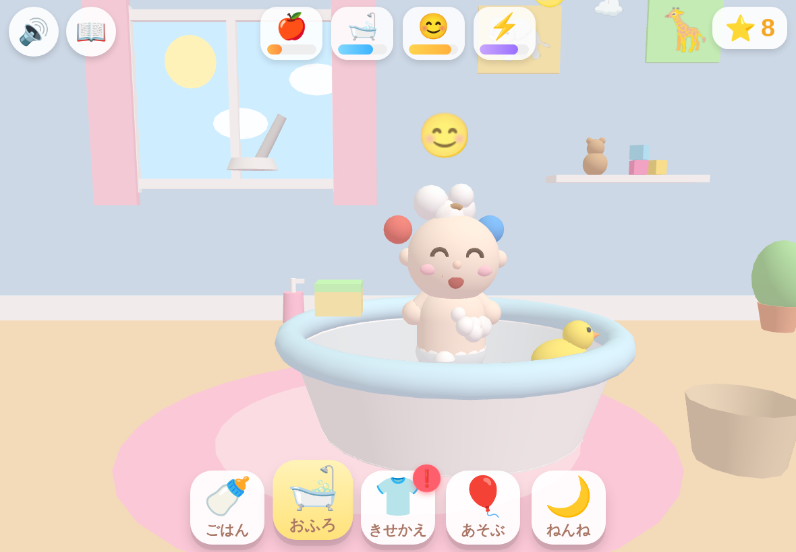
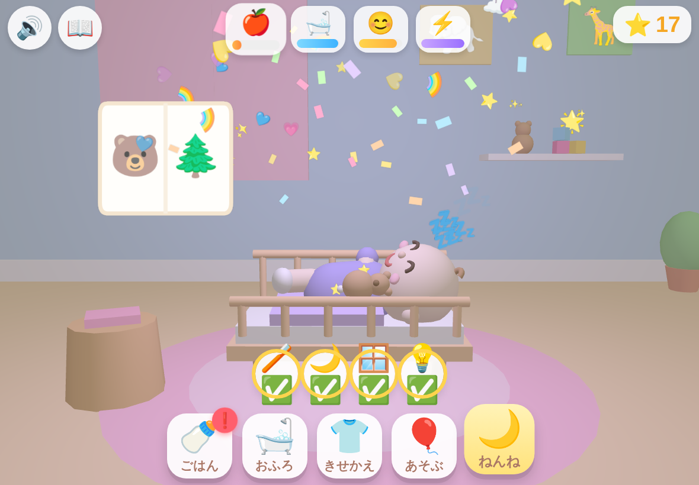

# 👶 あかちゃん おせわランド 3D

Baby Care Games for Kids 風の **3D あかちゃんおせわゲーム** です。
4歳のお子さまが iPad / iPhone の **縦画面・横画面どちらでも** 直感的に遊べるようにデザインしています。

すべてのおせわが「原因→**プロセス**→結果→**痕跡**」まで描写され、場面をまたいで状態がつながります
（食べこぼし→服のシミ→洗濯、遊ぶ→散らかる→お片付け、おふろ→濡れる→拭く…）。

| ごはん（哺乳瓶） | おふろ（泡ヘア） | ねんね（すやすや） |
|---|---|---|
|  |  |  |

## 🎮 あそびかた

タイトル画面の「▶ あそぶ！」をタップしてスタート。画面下の5つのボタンでおせわを切り替えます。
**文字が読めなくても遊べる**よう、アイコン・音・アニメーション・あかちゃん自身の指差しで伝わるようにしています。

### 🍼 ごはん — 食べ物ごとに食べ方がちがう

- **スタイ**（椅子に掛かっている）をタップして着けてから。着けないと**服にシミがつき、きせかえ・おふろへの動機**になります
- **哺乳瓶**：口にくわえる→ほっぺがぱくぱく→**瓶の中のミルクが減り気泡がボコボコ**→「ぷはー」→**背中を4回とんとん→げっぷ！**
- **ジュースパック**：まず**ストローを「プスッ」と刺し**、吸うと**パックがへこんでいき**、最後は「ズゾゾー」
- **りんご**：一口ごとに**三日月形のかじり跡**→芯が残る→**ゴミ箱にポイ**すると褒められる
- **バナナ**：**3回スワイプで皮むき**（皮がたれさがる）→むいてからでないと食べられない
- **おにぎり**：海苔がほっぺに貼りつき、**米粒が口の周りに残る**→つまむと「ぱくっ」
- **クッキー**：ボロボロこぼれてトレイと服が汚れる
- **おしぼり**で口の周りをふきふき→にっこり。食べ物を近づけると**顔が追って「あーん」**。満腹になると**ぷいっと顔をそむけて食べません**

### 🛁 おふろ — 脱がせるところから乾かすまで

1. **服を脱がせる**→脱いだ服は洗濯かごへ（シミ付きなら「要洗濯」に）
2. **お湯はり**：蛇口をひねり、**赤/青ノブで温度調整**（熱い🥵＝湯気モクモク「あちち！」/冷たい🥶＝ぶるぶる）→**手でお湯を確かめて**からザブーン
3. **洗う**：汚れは**原因と場所が一致**（食べこぼし=口周り・遊び=手・雨の日=足の泥）。シャンプーをプッシュ→頭をこすると**泡がモコモコ育ち、上へなでるとツノ泡ヘア**に
4. **すすぎ**：シャワーを**あてた場所だけ**泡が流れ落ちる
5. **乾かす**：タオルでふきふき（**拭き残しがあると「ハックション！」**）→ドライヤー「ブオー」で前髪がなびいて完了

### 👕 きせかえ — 一瞬で着替えない

- **頭から「すぽっ」→左腕→右腕→ボタンを1個ずつ「パチン」**の工程で着せる
- **汚れた服は「くさい！」**と鼻をつまんで拒否→**洗濯機でぐるぐる→物干しでポタポタ→ふわふわに乾く**まで見届ける
- **靴下と靴は片足ずつ**。あんよを上げて**けんけんバランス**でぐらぐら
- **天気・場面連動**：雨の日☔はレインコート＋長靴、眠そうな時はパジャマが「せいかい」でボーナス

### 🎈 あそぶ — 双方向のあそび

- **キャッチボール**：ボールを転がすと**ハイハイで追いかけ→よいしょと拾い→投げ返してくれる**
- **積み木**：1個ずつ積む→高いほどぐらぐら→**「ガッシャーン」で大爆笑**→散らかった積み木は**おもちゃ箱でお片付け**（放置すると部屋に散らかったまま！）
- **風船ラリー**：落とさないようにポンポン。5回続くとおほめ
- **木琴（ドレミソラ）と太鼓**：本物の音階が鳴り、**あかちゃんが体でリズムをとる**
- **いないいないばあ**：あたまをタップ→両手で目を隠して…「ばあ！」

### 🌙 ねんね — 眠りに落ちるまでを描く

- **ねんねの支度**：🪥仕上げ歯みがき（歯の汚れをこすり落として「ぺっ」）→🌙パジャマ→🪟カーテン→💡電気。**電気がついたままだと眠れず、あかちゃんがランプを指差して訴えます**
- **入眠の6段階**が見た目でわかる：げんき→**あくび**→**目をこしこし**→**うとうと（まぶたが重い）**→**こっくりこっくり**→すやすや
- **絵本の読み聞かせ**：ページをめくるたび、まぶたが下がっていく
- **とんとん**：ゆっくり一定のリズムで。**速すぎると目がぱっちり**開いちゃう
- **くまのぬいぐるみ**を腕の中に→ぎゅっと抱いて安心。眠ったら窓の外に**流れ星**🌟

## 🔁 場面をまたぐ「痕跡と連鎖」

- 食べこぼし→**服のシミ**→洗濯 or おふろ / 遊ぶ→**散らかり**→お片付け / おふろ→**濡れ**→拭かないと部屋でもくしゃみ
- おふろの後は**おむつ姿のまま**。きせかえで着せてあげるまで続きます
- **あかちゃんの自発行動**：おなかが空くと🍎を指差し、ごきげんだとバイバイ👋。ほしい食べ物をふきだしでリクエスト
- **中間の感情表現**：わくわく（そわそわ）・ふくれっ面（ほっぺぷくー）・てれ（ほっぺ赤らめ）・びっくり（目まんまる）

### メーターとごほうび

- 🍎おなか / 🛁きれい / 😊ごきげん / ⚡げんき の4メーター。減るとボタンに❗が出てあかちゃんがしょんぼり。**失敗・ゲームオーバーはありません**
- ⭐5個ごとに**シールずかん**📖に動物シールが増える（全12種）。⭐・シール・服・状態はすべて自動セーブ

## 📱 動かしかた

ビルド不要・依存ゼロ（Three.js は `lib/` に同梱、音は全てWebAudio合成）。

```bash
cd baby-care-3d
python3 -m http.server 8000
# → ブラウザで http://localhost:8000
```

- **GitHub Pages** で公開すれば iPad / iPhone の Safari からそのまま遊べます
- ホーム画面に追加するとフルスクリーンに（`apple-mobile-web-app-capable` 対応済み）
- 初回タップで音が有効になります（iOS の自動再生制限対応）

## 🗂 フォルダ構成

```
baby-care-3d/
├── index.html              # エントリーポイント（importmap + タイトル画面）
├── vendor/three/           # Three.js r180 + postprocessing addons（同梱・ビルド不要）
├── src/
│   ├── app.js              # アプリシェル：シーングラフ・フレームループ・収録API
│   ├── engine/
│   │   ├── render.js       # レンダラ・AgXトーンマップ・GTAO・ブルーム・被写界深度
│   │   ├── lighting.js     # キー/フィル/リムのライティングリグ・手続きIBL・時間帯
│   │   ├── materials.js    # PBRマテリアル集（表面下散乱スキンシェーダ含む）
│   │   ├── textures.js     # 手続きPBRテクスチャ生成（バイナリ素材ゼロ）
│   │   ├── camera.js       # 被写体相対カメラプリセット・手持ち揺れ・シェイク
│   │   ├── physics.js      # 剛体・積み木の安定スタック・布・ロープ（依存ゼロ）
│   │   ├── fx.js           # GPUインスタンシングパーティクル・リボン・デカール
│   │   ├── audio.js        # 効果音86種（全てWebAudio合成）
│   │   ├── synth.js        # DSP部品・手続きリバーブ
│   │   └── music.js        # BGM4曲・レイヤー適応
│   ├── world/
│   │   ├── room.js         # こどもべや本体・アンカー・散らかり
│   │   ├── props.js        # 家具・小物ビルダー
│   │   └── window.js       # 窓・外の景色・光の筋・天気
│   ├── character/
│   │   ├── baby.js         # あかちゃん統合API
│   │   ├── anatomy.js      # 陰関数サーフェスからの体形生成
│   │   ├── rig.js          # ボーン30本・スキニング・IK
│   │   ├── face.js         # 目・まぶた・眉・口・表情モーフ
│   │   ├── anim.js         # ポーズ・しぐさ・呼吸・二次モーション
│   │   ├── hair.js         # 髪
│   │   └── outfit.js       # 服（リグに追従）
│   ├── activities/         # ごはん・おふろ・きせかえ・あそぶ・ねんね
│   ├── fx/                 # 水面シミュ・泡・おもちゃ
│   ├── ui/                 # HUD・ベクターアイコン・シールずかん
│   └── game/               # メーター・セーブ
├── tools/
│   ├── shoot.mjs           # ヘッドレス収録（決定論的スクリーンショット）
│   └── shots.json          # 収録カット一覧
└── docs/
    ├── VISUAL_RUBRIC.md    # 品質基準（16項目の採点表・不具合チェックリスト）
    └── CRITIQUE-01.md      # 第1回ビジュアルレビュー
```

### 技術メモ

- **ビルド不要・依存ゼロ・完全オフライン。** Three.js は `vendor/` に同梱、
  テクスチャは全て起動時に手続き生成、音は全て WebAudio 合成。バイナリ素材は1つもありません
- **描画パイプライン**：RenderPass → GTAO → ブルーム → 仕上げパス（被写界深度・
  AgXトーンマップ・カラーグレード・周辺減光・粒状・色収差）→ SMAA
- **肌**は `MeshPhysicalMaterial` にラップ拡散＋裏面散乱を注入した疑似SSS。
  これが無いと赤ちゃんの肌はプラスチックに見えます
- **端末性能に応じて3段階**に自動調整（パーティクル数・水面グリッド・後処理）

## 🧒 4歳向け設計メモ

- タップ・スワイプ・ドラッグのみ。時間制限・失敗なし。工程は音声的ヒントとゆれる矢印的演出で誘導
- 小さな部品（蛇口・ボタン・あんよ）には**見えない大きな当たり判定**を付加
- 重なった対象は**手前優先ピック**で「見えているものに当たる」
- ボタンは最小50px以上。縦画面/横画面で自動レイアウト（横長低画面ではおせわボタンが右側へ）
- ピンチズーム・ダブルタップズーム・テキスト選択を無効化
