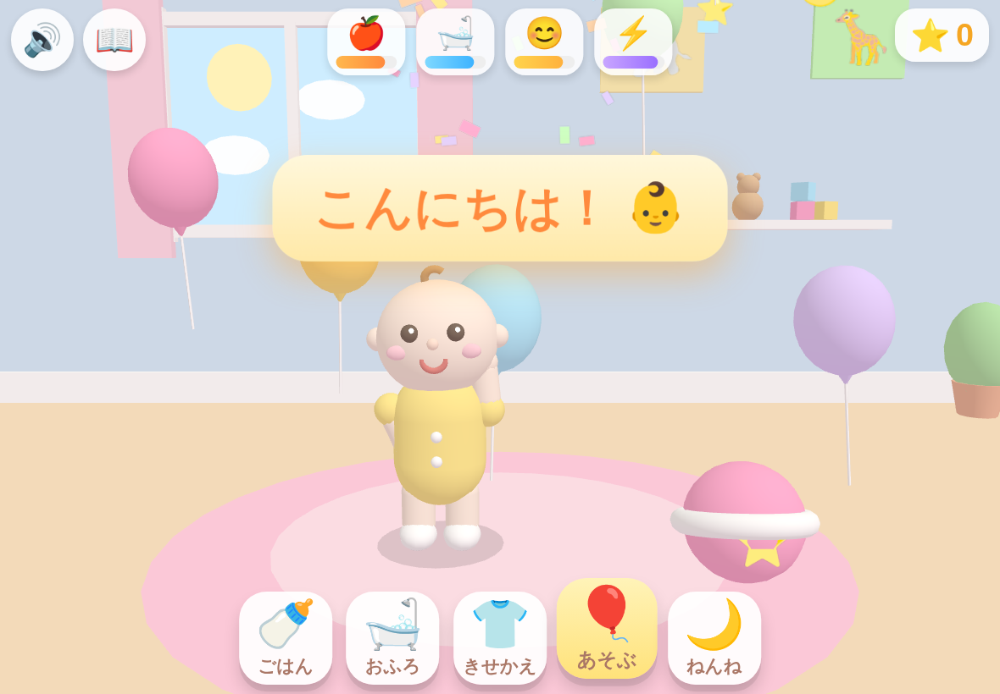
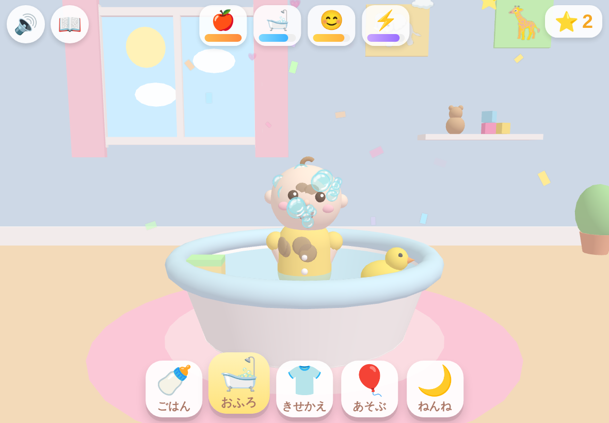
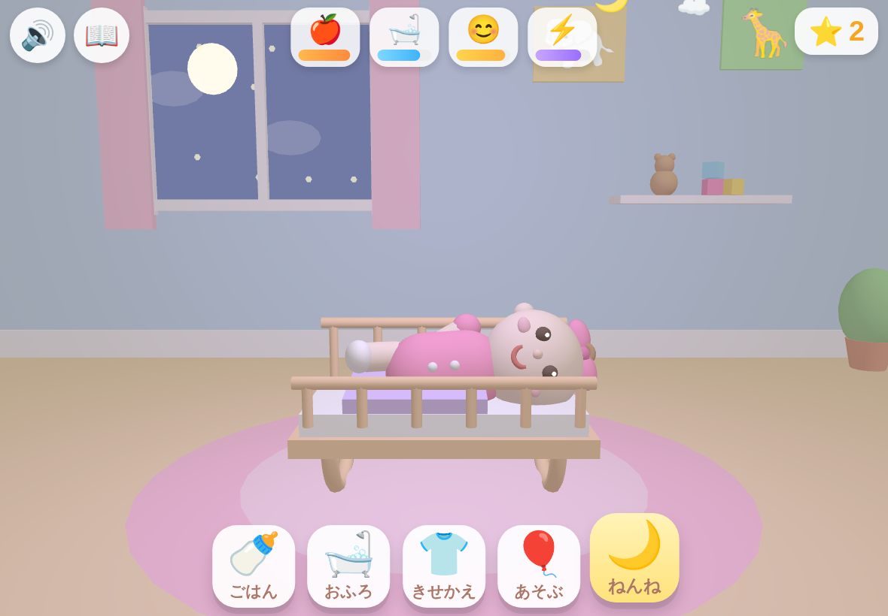

# 👶 あかちゃん おせわランド 3D

Baby Care Games for Kids 風の **3D あかちゃんおせわゲーム** です。
4歳のお子さまが iPad / iPhone の **縦画面・横画面どちらでも** 直感的に遊べるようにデザインしています。

| あそぶ | おふろ | ねんね |
|---|---|---|
|  |  |  |

## 🎮 あそびかた

タイトル画面の「▶ あそぶ！」をタップしてスタート。画面下の5つのボタンでおせわを切り替えます。
**文字が読めなくても遊べる**よう、すべてアイコンと音とアニメーションで伝わるようにしています。

### 5つのおせわ

- 🍼 **ごはん** — 6種類のたべものをタップ or ドラッグしてあかちゃんのお口へ。もぐもぐアニメ＆たべこぼし付き。ふきだしで「たべたいもの」をリクエストしてくるので、当てると⭐ボーナス＋紙吹雪！
- 🛁 **おふろ** — 泥んこのあかちゃんをスポンジでごしごし（こすると泡＆きゅっきゅ音）。あひるちゃんをタップすると「ガーガー」鳴いてジャンプ。全部きれいにしたら🚿シャワーで仕上げて「ぴかぴか！」
- 👕 **きせかえ** — 6色のロンパース × 7種類のぼうし（キャップ/りぼん/おうかん/くまみみ/パーティー/おはな）。📸カメラでフラッシュ撮影するとポーズ＆⭐ゲット。きせかえは自動セーブ。
- 🎈 **あそぶ** — ふわふわ飛ぶ風船をパンパン割って紙吹雪！ボールをタップすると跳ねてあかちゃんが拍手。あかちゃん本人をタップすると、こちょこちょで大笑い。
- 🌙 **ねんね** — 部屋がだんだん夜になり、オルゴールのこもりうたが流れます。ゆりかごを左右にゆらゆら＆なでなでして寝かしつけ。眠ったら流れ星🌟が窓を横切るのでタップでボーナス⭐。

### おせわメーター & ごほうび

- 画面上部の4つのメーター（🍎おなか / 🛁きれい / 😊ごきげん / ⚡げんき）が少しずつ減っていき、減りすぎるとボタンに「❗」が出て、あかちゃんがしょんぼりします。おせわで回復！**失敗やゲームオーバーはありません。**
- おせわをすると⭐がたまり、5個ごとに **シールずかん📖** に動物シールが1枚ずつ増えます（全12種）。
- ⭐・シール・きせかえ・メーターは `localStorage` に自動セーブされ、次回も続きから遊べます。

## ✨ たのしい要素 モリモリポイント

- プリミティブ組み立ての**ぷにぷに3Dあかちゃん**：まばたき・呼吸・にこにこ目（^ ^）・もぐもぐ・くすぐり笑い・拍手・バイバイ・ぴょんぴょん
- ハート/星/泡/紙吹雪/音符/💤/キラキラなどの**パーティクル演出**が全アクションに反応
- **昼夜サイクル**：窓の外の太陽・雲⇄月・またたく星、ねんね時は部屋全体がやさしい夜色に
- **効果音とBGMはすべてWebAudioでリアルタイム合成**（音声ファイル0個・オフラインOK）：ハッピーBGM、オルゴールこもりうた、あひるのガーガー、風船パン！など25種類以上
- 部屋の飾り：くまのぬいぐるみ、つみき、ゾウさん＆キリンさんの絵、観葉植物、くるくる回るモビール

## 📱 動かしかた

ビルド不要・依存ゼロ（Three.js は `lib/` に同梱）。静的ファイルをそのまま開くだけです。

```bash
# ローカルで
cd baby-care-3d
python3 -m http.server 8000
# → ブラウザで http://localhost:8000
```

- **GitHub Pages** で公開すれば iPad / iPhone の Safari からそのまま遊べます（`index.html` を開くだけ）。
- ホーム画面に追加するとフルスクリーンで遊べます（`apple-mobile-web-app-capable` 対応済み）。
- 初回タップで音が有効になります（iOS の自動再生制限対応）。

## 🗂 フォルダ構成

```
baby-care-3d/
├── index.html        # エントリーポイント（UI・スタイル込み）
├── lib/
│   └── three.min.js  # Three.js r150（同梱・オフライン動作）
├── src/
│   ├── audio.js      # WebAudio 合成サウンド（BGM 2曲 + 効果音25種）
│   ├── particles.js  # パーティクル演出システム
│   ├── baby.js       # 3Dあかちゃん（表情・ポーズ・きせかえ・よごれ）
│   ├── world.js      # こどもべや環境（昼夜・窓・家具）
│   ├── ui.js         # HUD・メーター・シールずかん・セーブ
│   ├── activities.js # 5つのおせわアクティビティ
│   └── main.js       # ゲームループ・入力・カメラ（縦横対応）
└── docs/             # スクリーンショット
```

## 🧒 4歳向け設計メモ

- タップとドラッグだけ。細かい操作・時間制限・失敗なし
- ボタンは最小 48px 以上、低いメーターは大きく脈動して気付ける
- 文字情報はひらがなの補助ラベルのみ。意味はアイコン・音・アニメで伝達
- ピンチズーム・ダブルタップズーム・テキスト選択を無効化（誤操作防止）
- 縦画面ではUIが上下に、横画面（低い画面）ではおせわボタンが右側に自動レイアウト
