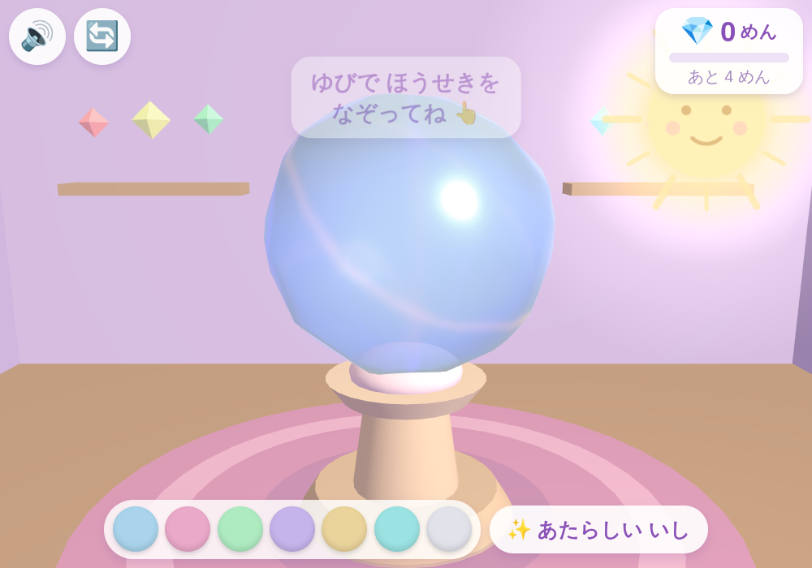
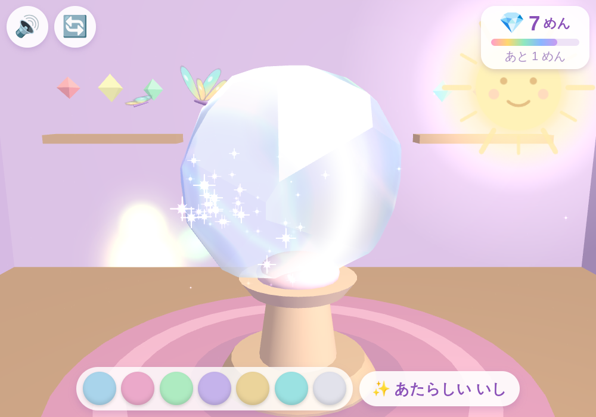
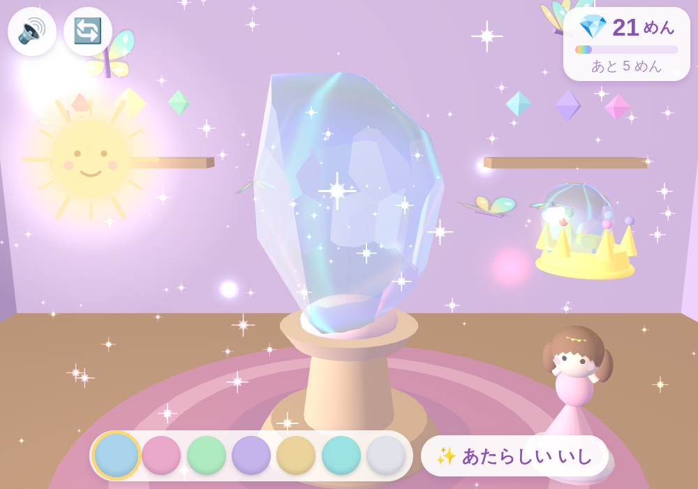
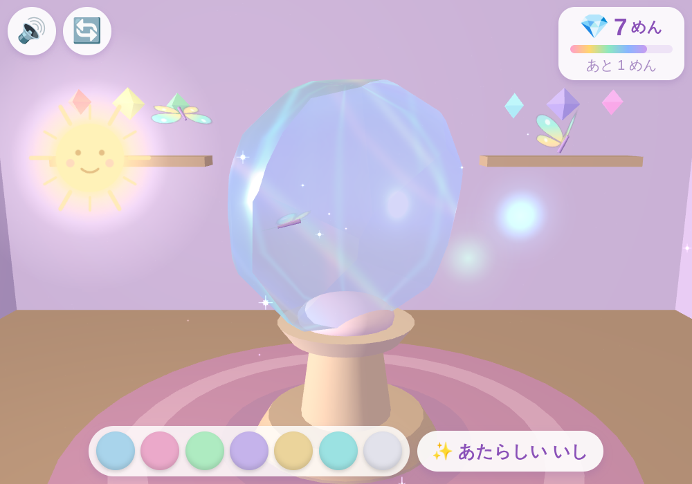
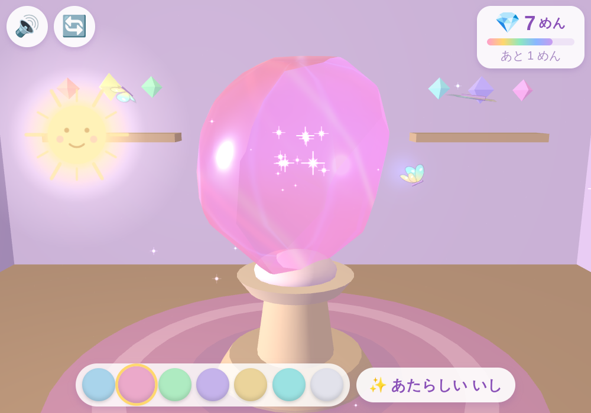
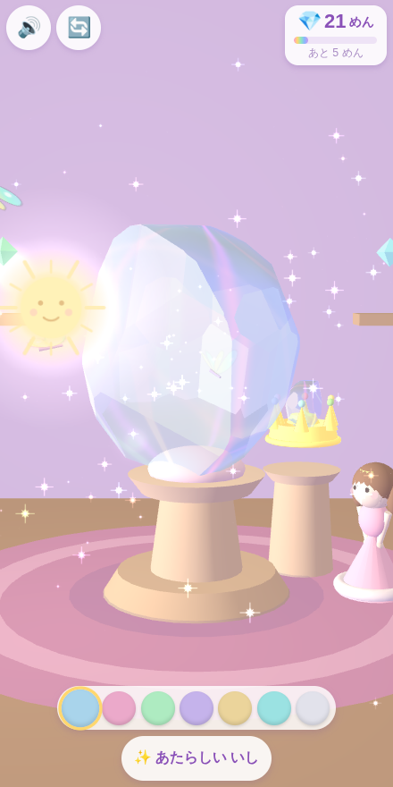

# 💎 にじいろ宝石工房

まるい とうめいな いしを **ゆびで なぞって けずる** だけの、3D 宝石みがきあそびです。
4歳のお子さまが iPad / iPhone の **縦画面・横画面どちらでも** 遊べるようにデザインしています。

**どこを どう けずっても 失敗しません。**
指の軌跡をそのまま切断面にはせず、宝石らしい「きれいな角度」へ自動で補正するので、
てきとうになぞっても、それらしい宝石になります。

| はじまりの まるい いし | けずって できた 面 | プリンセスと 王冠 |
|---|---|---|
|  |  |  |

## 🎮 あそびかた

タイトルの「▶ はじめる」をタップしてスタート。**文字が読めなくても**、なぞれば何かが起きます。

| そうさ | おきること |
|---|---|
| **みじかく なぞる** | ちいさな面ができる |
| **ながく なぞる** | おおきな面ができる |
| **なんども なぞる** | だんだん深く削れて、面がひろがる |
| **背景を ドラッグ** | 宝石がまわる → べつの場所を削れる |
| **たいようを ドラッグ** ☀️ | 光の当たりかたが変わり、壁の光の模様も動く |
| **🎨 いろのボタン** | 宝石の色を7色から選べる |
| **🔄 ボタン** | ゆっくり回りつづけるのを止める／再開する |

### ✨ 面ができた瞬間におきること

- **ピカッ**と反射する（太陽の向きと面の角度が合うと大きくきらめきます）
- **虹が壁に映る**（削った面から出た光が壁・床・天井へ飛びます）
- **宝石の内部を光の筋が走る**（削った場所から波のように広がります）
- **「キィン」「シャラン」**と鳴る（面が大きいほど低く、長く響きます）
- 削っているあいだは「シャリシャリ」というこすり音が、指の速さに合わせて鳴ります

## 🎁 ごほうび（おわりは ありません）

面がふえるほど、壁と床にうつる光の模様が複雑になっていきます。さらに——

| めん数 | おきること |
|---|---|
| 4 | ⭐ 宝石の中に**星がともる**（以降、削るたびに星がふえます） |
| 8 | 🦋 **にじいろの ちょうちょ**が飛んでくる |
| 12 | ✨ **部屋じゅうがキラキラ**しはじめる |
| 16 | 🦋🦋 ちょうちょがふえる |
| 20 | 👑 **小さなプリンセス**が歩いてきて、**宝石を王冠にはめて**くれる |
| 26／32／40／50 | 🌈🎉 虹が大きくなり、ちょうちょがふえ、工房がお祭りみたいに |

**「完成したから終了」にはなりません。** プリンセスが来たあとも、そのまま削りつづけたり、
太陽を動かして光であそんだりできます（王冠の中の宝石も、削るたびに同じ形に変わります）。

## 🧊 「失敗しない」しくみ

宝石は **半空間の交わり**（`{ x | n·x ≦ d }` の重なり）として持っていて、
なぞるたびに平面を1枚足して切り落とすだけ。だから立体が壊れることがありません。

- **自動補正**：なぞった場所の向きを、宝石らしい対称の角度（テーブル面・クラウン・ガードル・パビリオン、計66方向）のうち、いちばん近いものへ吸い付かせます
- **同じ場所ばかり削ったとき**は、限界まで削れた向きの**となりへそっとずらす**ので、本物のカットのように面が広がり、石がぺちゃんこになりません
- **1回で削れる体積に上限**があり、削ったぶんは自動でおぎなわれるので、**石が小さくなって消えることはありません**（何回でも削りつづけられます）
- 削った面は**フラット**に、まだ削っていないところは**すりガラス**のように描き分け。面がふえるほど曇りが晴れて、すきとおっていきます

## 📱 動かしかた

ビルド不要・依存ゼロ（Three.js は `lib/` に同梱、音はすべて WebAudio 合成）。

```bash
cd gem-workshop-3d
python3 -m http.server 8000
# → ブラウザで http://localhost:8000
```

- **GitHub Pages** で公開すれば iPad / iPhone の Safari からそのまま遊べます
- ホーム画面に追加するとフルスクリーンに（`apple-mobile-web-app-capable` 対応済み）
- 初回タップで音が有効になります（iOS の自動再生制限対応）
- 削った記録と色は自動セーブされ、次に開いたときも同じ宝石から続けられます

## 🗂 フォルダ構成

```
gem-workshop-3d/
├── index.html        # エントリーポイント（UI・スタイル込み）
├── lib/three.min.js  # Three.js r150（同梱・オフライン動作）
├── src/
│   ├── fx.js         # テクスチャ生成・火花・虹のかけら・空気のキラキラ
│   ├── audio.js      # WebAudio合成（キィン／シャラン／こすり音／オルゴールBGM）
│   ├── convex.js     # 凸多面体カットエンジン（宝石の形そのもの）
│   ├── gem.js        # 宝石（角度の自動補正・屈折と分散のシェーダ・内部の星）
│   ├── room.js       # こうぼう・太陽・壁にうつる光の模様（コースティクス）
│   ├── rewards.js    # ちょうちょ・プリンセス・王冠・お祝い演出
│   └── main.js       # ゲームループ・入力・セーブ
└── docs/             # スクリーンショット
```

## 🧒 4歳向け設計メモ

- 操作は**なぞる・ドラッグするだけ**。時間制限・スコア・ゲームオーバーはありません
- なぞったのに何も起きない、が起きないように、**かならず面ができる**ようにしてあります
- 太陽は画面の外へ出ていかないよう、いつでもつかめる位置に自動でおさまります
- 「✨ あたらしい いし」は押しまちがい防止のため**2段階**（かくにん画面つき）
- ボタンは最小50px以上。縦画面・横画面の両方でレイアウトが自動調整されます
- ピンチズーム・ダブルタップズーム・テキスト選択は無効化

| たいようを うごかす | いろを かえる | たて画面 |
|---|---|---|
|  |  |  |
