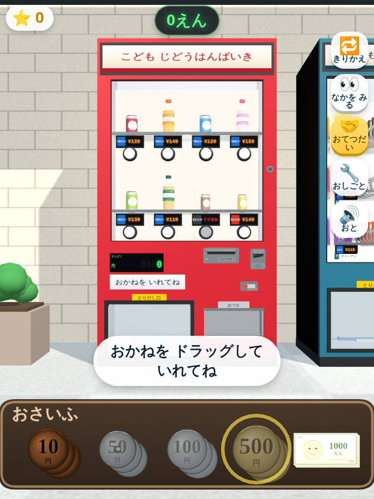
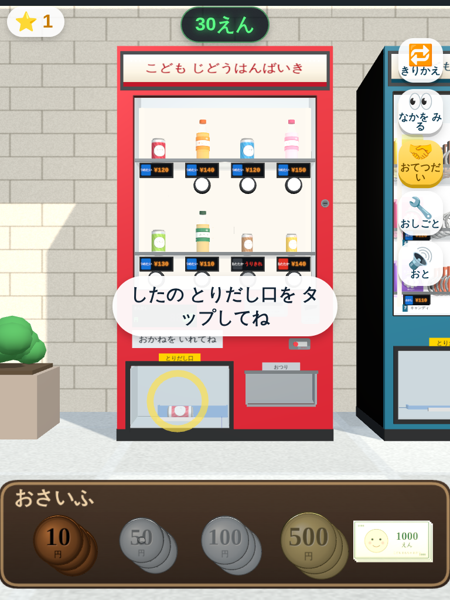
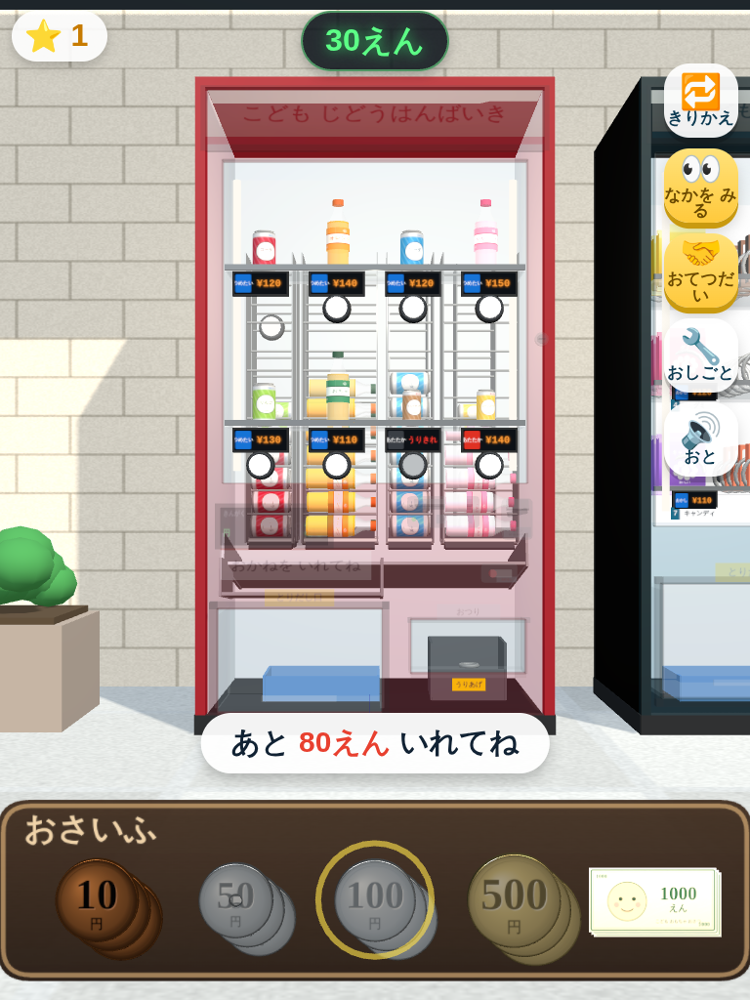
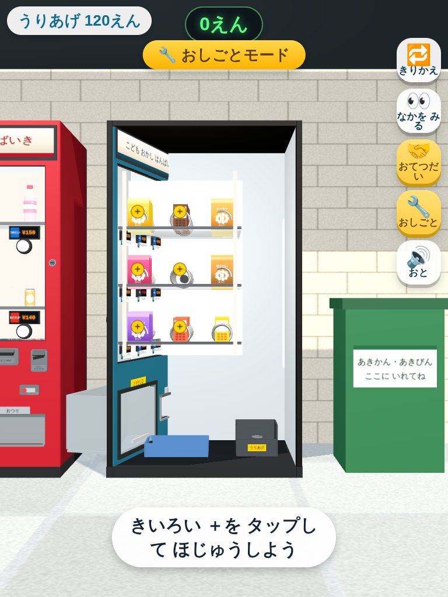
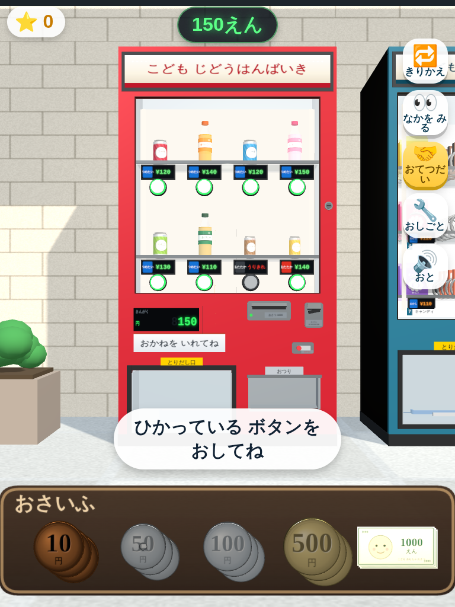
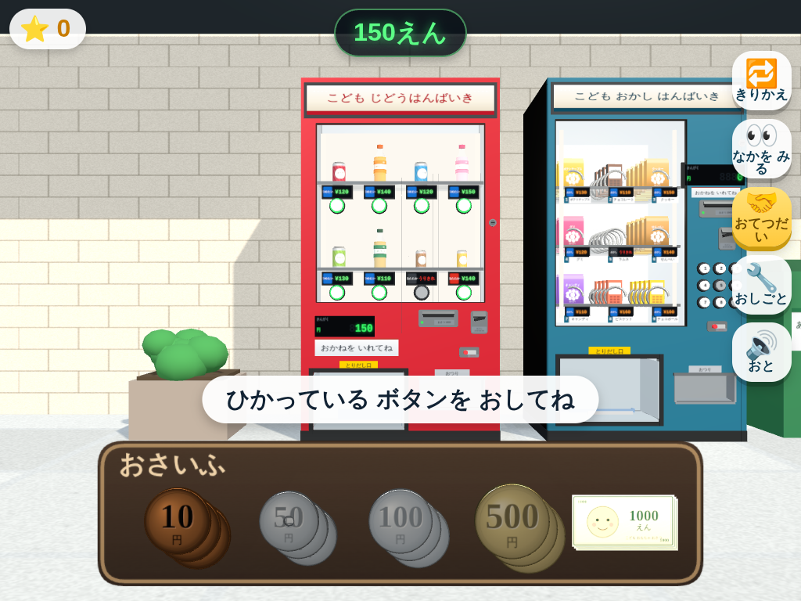
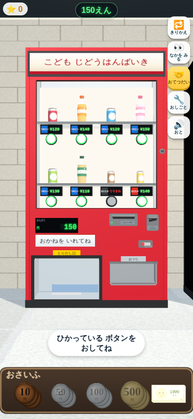

# じはんき シミュレーター 3D

4歳児が iPad / iPhone のたて画面・よこ画面で遊ぶことを想定した、
**3D自動販売機のリアルシミュレーションゲーム**です。

お金を入れる → 機械がお金を認識する → 商品ボタンを押す → 機械の内部で商品が本物同様に動く
→ 下部の取出口から取り出す、という一連の流れを、実機の構造どおりに再現しています。

| | |
|---|---|
|  |  |
| 実機どおりの前面（見本窓・値札・ボタン・金銭ユニット・取出口） | ボタンを押すと商品が落ちてきて取出口にたまる |
|  |  |
| 「なかを みる」で内部のサーペンタイン式コラムが見える | 「おしごと」で扉をあけて補充・集金 |

---

## あそびかた

| そうさ | やること |
|---|---|
| 画面下の**おさいふ**から硬貨・紙幣を**ドラッグ**して投入口へ | お金を入れる |
| **光っているボタン**をタップ | 商品を選ぶ |
| **とりだし口**をタップ | 落ちてきた商品を手に取る |
| 手の中の商品をタップ | プルタブ／キャップ／袋をあける → のむ・たべる |
| **リサイクルボックス**（または🗑️ボタン） | 空き容器をすてる |
| **おかえしレバー**をタップ → **おつり皿**をタップ | おつりを戻して受け取る |

### 画面右のボタン

| ボタン | はたらき |
|---|---|
| 🔁 きりかえ | 飲料機 ⇔ おかし機 を切りかえる |
| 👀 なかを みる | 前面パネルを透かして、**内部機構**を見えるようにする |
| 🤝 おてつだい | 次に入れるべき硬貨がおさいふで光る（初期状態=ON） |
| 🔧 おしごと | 鍵をあけて前扉を開き、**補充・集金**をする店員さんモード |
| 🔊 おと | 効果音のON/OFF |

---

## 再現している「本物のしくみ」

### 金銭ユニット
- **硬貨**：10円・50円（穴あき）・100円・500円。実物の直径比（23.5 / 21.0 / 22.6 / 26.5 mm）でモデリング。
- **紙幣**：1000円。挿入口に近づけると**ローラーに吸い込まれる**演出（吸い込み音つき）。
  お札は実在紙幣の複製ではなく、**あそび用の架空デザイン**（「こども おもちゃ おさつ」）にしています。
- 硬貨をお札の口に入れようとする等、**金種と投入口が合わない場合はやさしく差し戻す**。
- **7セグ風のLED金額表示**（消灯セグメントまで描画）。
- **返却レバー**を引くと、投入額が金種に分解されて釣銭皿に**カラカラと落ちる**。

### 飲料自販機（サーペンタイン式）
実機と同じく「見本は残り、在庫は別のコラムから出る」構造です。

1. 前面は**見本の陳列窓**（ガラス・棚・庫内照明・つめたい/あたたかいタグ・売切ランプ）。
2. 内部には**サーペンタイン式コラム**が 4列 × 2段（前列・後列）。缶が横倒しでジグザグに積まれています。
3. ボタンを押すと**コラム下端の払出ローターが回転**し、いちばん下の1本だけを解放。
4. 商品は**集合シュートを転がり落ち**（すべらず、進んだ距離ぶんだけ回転します）、
5. **取出口のフラップを押し開けて**受け皿に着地します。
6. 残った在庫は1段ずつ下へ落ちてきます。

### おかし自販機（スパイラルコイル式）
1. 全面ガラスで、**見本ではなく在庫そのもの**が見えます。
2. 各段に**らせんコイル**が3本。ボタンを押すとコイルが**ちょうど1回転**します。
3. らせんが1回転＝商品が**1ピッチ前進**。いちばん前の1個が棚のふちを越えて落下します。
4. 後ろの在庫も1ピッチずつ前に詰めます。
5. 商品はガラスをかすめながら回転して落ち、取出口に着地します。

### 商品
- **缶**：プルタブを引き起こすと「プシュッ」＋炭酸の泡、飲み口が現れます。
- **ペットボトル**：キャップをねじって外し、**飲むたびに中身の液面が下がります**。
- **袋菓子・箱菓子・ラムネ**：あけて食べると、袋がぺたんこになります。
- 空き容器は**リサイクルボックス**へ。

### 4歳児むけの配慮（やさしいリアル＋お手伝いモード）
- 金額が足りないときは**ボタンが光らず**買えない（＝お金の学習になる）が、
  怒られる表現はせず「あと ○えん！」とやさしく案内。
- **おてつだいモード**では、次に入れるべき硬貨がおさいふで光ってはずみます。
- おつりは自動で正確に計算。売切れは**お仕事モードで補充すれば復活**。
- タップ判定は大きめ（お金のドロップ判定は画面短辺の20%）。
- 商品は本体をどこでもタップすればOK。

---

## 動かしかた

ビルド不要です。`index.html` をブラウザで開くだけで動きます。

```bash
# そのまま開く
open vending-machine-3d/index.html

# 端末で見るときはローカルサーバー経由が確実
cd vending-machine-3d && python3 -m http.server 8000
# → http://<PCのIP>:8000/ を iPad / iPhone の Safari で開く
```

iPad / iPhone では Safari の「ホーム画面に追加」をすると、
アドレスバーなしの全画面（`apple-mobile-web-app-capable`）で遊べます。

> 音は端末の仕様上、**最初のタップ（「はじめる」）以降**に鳴りはじめます。

---

### 画面の向き

| iPad たて | iPad よこ | iPhone たて |
|---|---|---|
|  |  |  |

たて／よこ、iPad／iPhone のどの比率でも自販機が見切れず、
おさいふが必ず画面の下に出るようにカメラを自動調整しています。

---

## ファイル構成

```
vending-machine-3d/
├── index.html              画面・CSS・HUD・スクリプト読み込み
├── docs/                   スクリーンショット
├── lib/
│   └── three.min.js        three.js（r150系・同梱／CDN不要）
└── src/
    ├── util.js             数学・トゥイーン・Canvasテクスチャ・形状ヘルパー
    ├── audio.js            WebAudioによる効果音の合成（音源ファイル不要）
    ├── products.js         商品カタログと3Dモデル（缶/ペット/袋/箱/筒）
    ├── machine_parts.js    共通パーツ（筐体・投入口・レバー・取出口・釣銭皿・鍵）
    ├── machine_base.js     シャーシ（前扉の開閉・X線モード・金銭ユニット配置）
    ├── machine_drink.js    飲料自販機（サーペンタイン式コラム＋シュート）
    ├── machine_snack.js    おかし自販機（スパイラルコイル式）
    ├── money.js            硬貨・紙幣・おさいふ（カメラ固定UI）
    ├── world.js            歩道・建物・リサイクルボックス・照明
    ├── consume.js          取り出す／あける／のむ・たべる／すてる
    ├── restock.js          お仕事モード（補充・集金）
    ├── ui.js               HUD（DOM）
    └── main.js             ゲーム本体（入力・カメラ・購入の流れ）
```

外部リソースはひとつも使っていません（three.js も同梱、テクスチャは全部Canvasで生成、
効果音はWebAudioで合成）。オフラインでもそのまま動きます。

---

## 技術メモ

- **依存**：three.js のみ（グローバル `THREE` を素の `<script>` で読み込み）。
  ES Modules を使っていないので `file://` で直接開いても動きます。
- **画面の向き**：`resize()` で「自販機の足もとが画面の73%の位置に来る」ようにカメラの距離と
  注視点の高さを逆算しています。カメラは水平のままなので、前面パネルが台形にゆがみません。
  たて長の iPhone では横幅から必要な画角を計算し直すので、機械が見切れません。
- **おさいふ**：カメラの子オブジェクトにしてあるため、画面の向きが変わっても常に画面下に出ます。
- **ドラッグ**：カメラに平行な平面上で動かし、投入判定は**スクリーン座標の距離**で行います
  （小さな指でも入れやすくするため）。
- **色**：`THREE.ColorManagement` を有効にし、`outputEncoding = sRGBEncoding` で描画。
- **影**：筐体だけが影を落とす設定にして、ガラスや庫内で無駄な影が出ないようにしています。

### デバッグ用の入口

`window.VMDebug`（別名 `window.__vm`）から状態を確認できます。

```js
__vm.credit()          // いまの投入額
__vm.stars()           // ほしの数
__vm.pickAt(x, y)      // その画面座標で何に当たるか
__vm.setMaxDt(0.5)     // 描画が極端に遅い環境で早送りする（自動テスト用）
__vm.forceClear()      // 手持ち・取出口・釣銭をリセット
```
